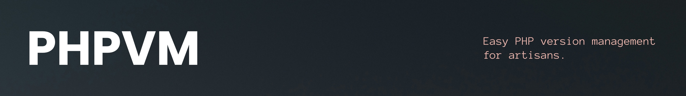

[](https://github.com/Thavarshan/phpvm)

[](https://github.com/Thavarshan/phpvm/releases)
[](https://github.com/Thavarshan/phpvm/actions/workflows/test.yml)
[](https://github.com/Thavarshan/phpvm/actions/workflows/use.yml)
[](https://opensource.org/licenses/MIT)

## Table of Contents

- [Introduction](#introduction)
- [About phpvm](#about-phpvm)
- [Installation](#installation)
  - [Install & Update Script](#install--update-script)
  - [Verify Installation](#verify-installation)
  - [Manual Install](#manual-install)
  - [Manual Update](#manual-update)
- [Usage](#usage)
  - [Installing PHP Versions](#installing-php-versions)
  - [Switching PHP Versions](#switching-php-versions)
  - [Uninstalling PHP Versions](#uninstalling-php-versions)
  - [Listing Installed Versions](#listing-installed-versions)
  - [Default Version](#default-version)
  - [System PHP Version](#system-php-version)
  - [Using a Mirror](#using-a-mirror)
- [Running Tests](#running-tests)
- [Uninstallation](#uninstallation)
- [Troubleshooting](#troubleshooting)
- [Maintainers](#maintainers)
- [License](#license)
- [Disclaimer](#disclaimer)

## Introduction

`phpvm` is a PHP Version Manager that allows you to easily install, switch between, and manage multiple PHP versions via the command line.

**Example:**

```sh
$ phpvm use 7.4
Now using PHP v7.4.10
$ php -v
PHP 7.4.10
$ phpvm use 8.0
Now using PHP v8.0.8
$ php -v
PHP 8.0.8
$ phpvm install 8.1
Now using PHP v8.1.1
$ php -v
PHP 8.1.1
```

## About phpvm

`phpvm` is a version manager designed to be used on Unix-like systems, including macOS and Linux. It allows you to install and manage PHP versions, switch between them seamlessly, and work with multiple versions on your system.

### Key Features

- Install and use different PHP versions.
- Easily switch between PHP versions.
- Manage global PHP settings and extensions.
- Install PHP versions via package managers like `apt` or `brew`, or from source.

## Installation

### Install & Update Script

To **install** or **update** phpvm, run the following command using either `curl` or `wget`:

```sh

curl -o- https://raw.githubusercontent.com/Thavarshan/phpvm/0.0.1/bin/install.sh | bash
```

```sh
wget -qO- https://raw.githubusercontent.com/Thavarshan/phpvm/0.0.1/bin/install | bash
```

This script clones the `phpvm` repository into `~/.phpvm` and attempts to add the following lines to your profile (`~/.bashrc`, `~/.zshrc`, or `~/.profile`):

```sh
export PHPVM_DIR="$HOME/.phpvm"
[ -s "$PHPVM_DIR/index.js" ] && \. "$PHPVM_DIR/index.js" # This loads phpvm
```

### Verify Installation

To verify that `phpvm` has been installed, run the following command:

```sh
command -v phpvm
```

This should output `phpvm` if the installation was successful.

### Manual Install

To manually install `phpvm`, clone the repository:

```sh
git clone https://github.com/Thavarshan/phpvm.git ~/.phpvm
```

Then add the following lines to your shell's profile (`~/.bashrc`, `~/.zshrc`, etc.):

```sh
export PHPVM_DIR="$HOME/.phpvm"
[ -s "$PHPVM_DIR/index.js" ] && \. "$PHPVM_DIR/index.js" # This loads phpvm
```

### Manual Update

To manually update `phpvm` to the latest version, use the following commands:

```sh
cd ~/.phpvm
git fetch --tags origin
git checkout `git describe --abbrev=0 --tags`
source ~/.phpvm/index.js
```

## Usage

### Installing PHP Versions

To install a specific version of PHP, run:

```sh
phpvm install 8.1
```

This will install PHP version 8.1. You can also install PHP using a package manager:

```sh
phpvm install --package-manager 7.4
```

### Switching PHP Versions

To switch between installed versions:

```sh
phpvm use 8.0
```

This will switch to PHP 8.0. You can verify the active version by running:

```sh
php -v
```

### Uninstalling PHP Versions

To uninstall a version of PHP:

```sh
phpvm uninstall 7.4
```

This will uninstall PHP 7.4 from the system.

### Listing Installed Versions

To list the installed PHP versions:

```sh
phpvm list
```

This will display all the PHP versions managed by `phpvm`.

### Default Version

To set the default PHP version for new shells, use:

```sh
phpvm alias default 8.0
```

This will ensure that PHP 8.0 is used as the default version whenever a new shell is opened.

### System PHP Version

To use the system-installed version of PHP:

```sh
phpvm use system
```

### Using a Mirror

To use a mirror of PHP binaries, set the `PHPVM_MIRROR` environment variable:

```sh
export PHPVM_MIRROR=https://php-mirror-url.com
phpvm install 8.0
```

## Running Tests

You can run tests using Jest. Install the dependencies and run the following command:

```sh
npm install
npm test
```

This will run all tests defined for `phpvm`.

## Uninstallation

To manually uninstall `phpvm`, run:

```sh
rm -rf ~/.phpvm
```

And remove the following lines from your shell's profile:

```sh
export PHPVM_DIR="$HOME/.phpvm"
[ -s "$PHPVM_DIR/index.js" ] && \. "$PHPVM_DIR/index.js" # This loads phpvm
```

## Troubleshooting

If you encounter any issues with `phpvm` or its functionality, consider the following troubleshooting steps:

- Make sure your shell configuration file is correctly sourcing `phpvm`.
- For macOS, ensure that the necessary command line tools (like Homebrew or Xcode) are installed.
- Restart your terminal after making any changes.

## Maintainers

`phpvm` is maintained by [Jerome Thayananthajothy](https://github.com/Thavarshan).

## License

This project is licensed under the MIT License. See [LICENSE](./LICENSE) for more details.

## Disclaimer

`phpvm` is an open-source tool designed to simplify PHP version management. While we strive to ensure its functionality across different platforms and configurations, we make no warranties or guarantees regarding its accuracy, completeness, reliability, or suitability for any particular purpose.

**Use at your own risk.** By using `phpvm`, you acknowledge that the developers and contributors are not responsible for any damages or data loss resulting from the installation, configuration, or use of this tool.

We recommend reviewing the source code, running tests, and using the tool in a controlled environment before deploying it in production settings. Contributions are always welcome, but please ensure any changes are well-tested and follow best practices.

If you encounter issues or need assistance, please open an issue on our GitHub repository, but note that support is offered as time and resources allow.
